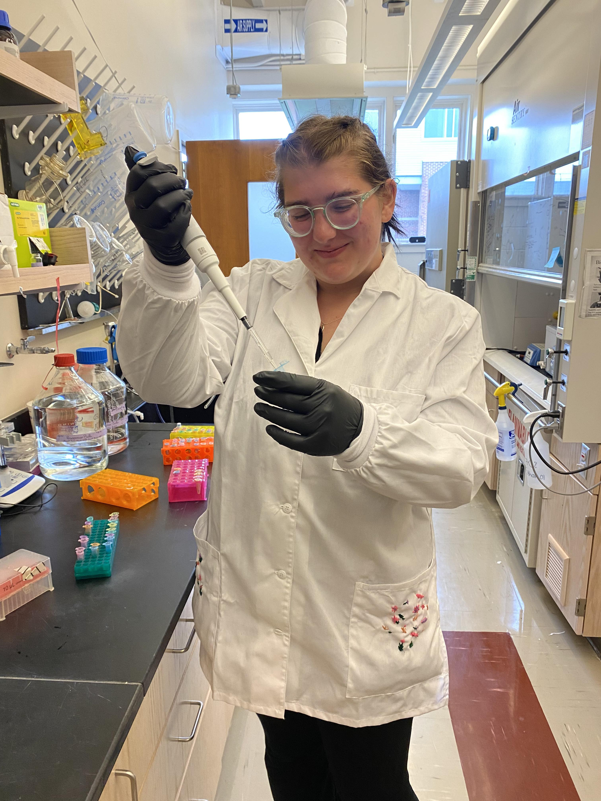

{width="250"}

#### What does Madigan study?

Madigan is a third year student at the [University of New Hampshire](https://colsa.unh.edu/){style="color: magenta"} studying Biomedical Science. Her area of concentration is medical microbiology, and she is working towards a minor in chemistry.

 

#### What does Madigan do outside of classes?

Madigan is a undergraduate researcher in [NATO Lab](https://www.natolab.com/){style="color: magenta"}, a biomaterials and polymer science lab.

 

There, she primarily works on development and optimization protocol for isolation and purification of plasmid DNA (pDNA), as well as optimization protocol for the source of the pDNA, which is generated via bioreactor-based fermentation processes. The purified pDNA is then utilized as a precursor for biomaterials such as DNA hydrogels.

 

She also is a student assistant in the 3 Engineering and Physical Science Libraries at UNH campus, a barista, and a hobby runner.

 

### Relevant Certifications and Trainings

| Certifications                                        | Date of Achievement   |
|--|---------------------------------------------------------------------------------------------------------------------------------------------------------------------------------------------|
| QPR Gatekeeper                                        | March 2022            |
| FEMA IS-700.b                                         | November 2022         |
| FEMA IS-5.a                                           | November 2022         |
| FEMA IS-100.c                                         | November 2022         |
| UNH CEMS Bloodborne Pathogens                         | May 2023              |
| UH CEMS Autoclaving Hazardous Waste                   | May 2023              |
| UNH CEMS BSL-1                                        | May 2023              |
| UNH CEMS BSL-2                                        | May 2023, August 2023 |
| UNH CEMS Magnet Safety (NMR, Superconducting magnets) | May 2023              |
| UNH CEMS Cryogenic Liquid Sagety Training             | May 2023              |
| UNH CEMS Animal Subjects                              | August 2023           |
